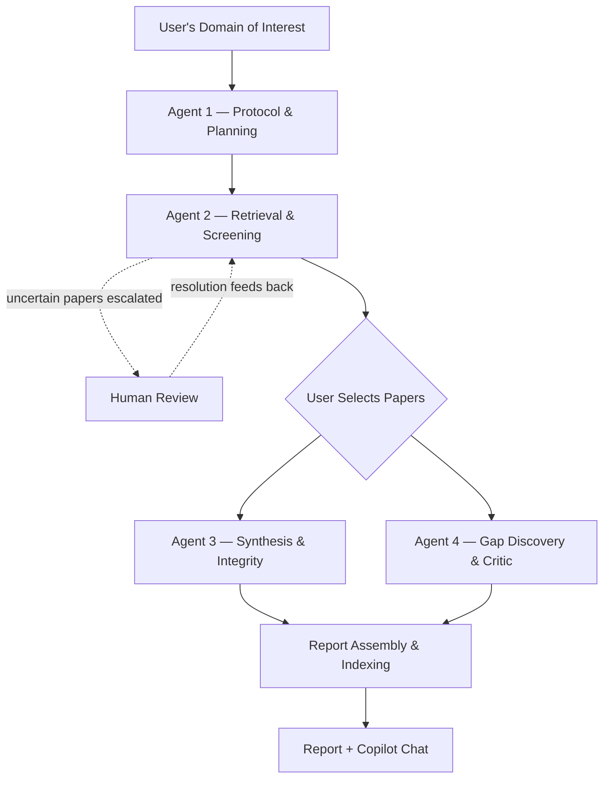

# Evidence-Backed Research Assistant

> A multi-agent AI system that turns a research domain into a systematically screened, evidence-backed report — every relevance decision is quoted and traceable, and every research gap is surfaced only once multiple independent papers back it up.

---

## Why This Exists

Before any serious research or R&D work can start, someone has to answer three things: what already exists, is it any good, and what's actually left to explore. Today that's manual — reading hundreds of papers, judging which are even relevant, and trying to spot patterns by memory. It's slow, inconsistent across reviewers, and doesn't scale down to a single student or small lab.

This project replaces that manual process with a coordinated pipeline of AI agents — each with a narrow, verifiable job — that retrieves literature, screens it against explicit criteria, and surfaces patterns across papers, without pretending to more certainty than the underlying evidence supports.

## What It Does

1. **You enter a research domain** — e.g. *"AI for early crop disease detection"*
2. **The system retrieves and screens candidate papers** from free academic APIs, judging each one relevant or not with a quoted justification
3. **You review a ranked list and select which papers to keep**
4. **A report is generated** — an evidence table, flagged contradictions between papers, and evidence-backed candidate research gaps
5. **You explore the report through a Copilot-style chat**, grounded in what was actually found — with an optional live-web mode, clearly separated from the verified report

## How It Works



| Agent | Role |
|---|---|
| **1 — Protocol & Planning** | Turns the domain into a formal protocol: inclusion/exclusion criteria and search queries written correctly per source |
| **2 — Retrieval & Screening** | Retrieves candidates and judges each one `INCLUDE` / `EXCLUDE` / `UNCERTAIN`, backed by a quoted line from the abstract |
| **3 — Synthesis & Integrity** | Builds the evidence table from the selected papers, flags contradictions, checks for retractions |
| **4 — Gap Discovery & Critic** | Finds limitations that recur across multiple papers and turns them into evidence-backed candidate gaps |
| **Report Assembly** *(not an agent)* | Merges Agent 3 + Agent 4's output into one report and indexes it for the chat — no LLM call |

Full task-by-task breakdown, edge-case handling, and the LangGraph implementation details live in [`docs/agent-build-reference.md`](docs/agent-build-reference.md).

## Key Features

- **Quoted, auditable relevance decisions** — every screening verdict is backed by an exact line from the source abstract, not a bare score
- **Evidence-backed gap discovery** — a candidate gap only surfaces once multiple independent papers admit to the same limitation, each labelled with its exact support count
- **Human-in-the-loop by design** — uncertain papers are escalated to the user, never silently resolved
- **Cost-aware architecture** — LLM calls are reserved for genuine judgment tasks; deduplication, ranking, and retraction checks run on free, deterministic methods
- **Grounded chat, not open generation** — the Copilot sidebar answers from the indexed report by default, with live-web answers clearly tagged and never silently merged into the evidence

## Tech Stack

| Layer | Technology |
|---|---|
| Orchestration | [LangGraph](https://github.com/langchain-ai/langgraph) |
| Backend | FastAPI |
| LLM | Gemini API (free tier) |
| Embeddings | Sentence Transformers |
| Vector search | FAISS |
| Storage | SQLite |
| Frontend | React (Vite + TypeScript) |

## Data Sources

Retrieval draws from free academic and gray-literature APIs — [OpenAlex](https://openalex.org/), [Semantic Scholar](https://www.semanticscholar.org/product/api), [Crossref](https://www.crossref.org/), [arXiv](https://arxiv.org/help/api), and [DOAJ](https://doaj.org/api/docs). Full access details, sample requests, and known limitations for each are documented in [`docs/data-sources.md`](docs/data-sources.md).

## Project Status

**Current scope is intentionally simplified for early development** — automated credibility scoring and dataset-feasibility checking are designed but not yet built, in favor of getting the core pipeline working end to end first.

- [x] System architecture and agent design
- [x] Data source research and API access design
- [ ] Agent 1 — Protocol & Planning
- [ ] Agent 2 — Retrieval & Screening
- [ ] Human paper-selection checkpoint
- [ ] Agent 3 — Synthesis & Integrity
- [ ] Agent 4 — Gap Discovery & Critic
- [ ] Report Assembly & Indexing
- [ ] Copilot chat interface
- [ ] **Roadmap:** structural credibility scoring (study design, sample size, venue, retraction status)
- [ ] **Roadmap:** dataset-feasibility check on candidate gaps

## Getting Started

### Prerequisites
- Python 3.11+
- Node.js 18+
- A Gemini API key (free tier — [ai.google.dev](https://ai.google.dev/))

### Installation

```bash
git clone https://github.com/<your-username>/<your-repo>.git
cd <your-repo>

# backend
pip install -r requirements.txt --break-system-packages

# frontend
cd frontend
npm install
```

### Configuration

Create a `.env` file in the project root (backend):

```env
GEMINI_API_KEY=your_key_here
OPENALEX_MAILTO=you@example.com
```

Create a `.env` file in `frontend/`:

```env
VITE_API_BASE_URL=http://localhost:8000
```

### Running locally

```bash
uvicorn app.main:app --reload    # backend
cd frontend && npm run dev       # frontend, separate terminal
```

## Responsible AI

- Every relevance verdict is traceable to a quoted source line — never an unexplained score
- Uncertain papers are always escalated to the user, never auto-resolved
- Free academic sources skew toward well-indexed, English-language, often Western research — a stated limitation, not a hidden one
- Structural credibility scoring (once built) checks *what type* of study something is, not whether the science was executed correctly
- The chat assistant never blends live-web answers into the verified report without an explicit user action
- Live-web search (Copilot Web mode) runs with safe search filtering enabled, to avoid surfacing inappropriate or harmful content in results

## Contributing

This is currently a university course project (IT 3041 — Information Retrieval and Web Analytics, SLIIT). Issues and suggestions are welcome via GitHub Issues.

## Acknowledgments

Built on top of [OpenAlex](https://openalex.org/), [Semantic Scholar](https://www.semanticscholar.org/), [Crossref](https://www.crossref.org/), [arXiv](https://arxiv.org/), and [DOAJ](https://doaj.org/) — all free, open scholarly data sources this project would not be possible without.
